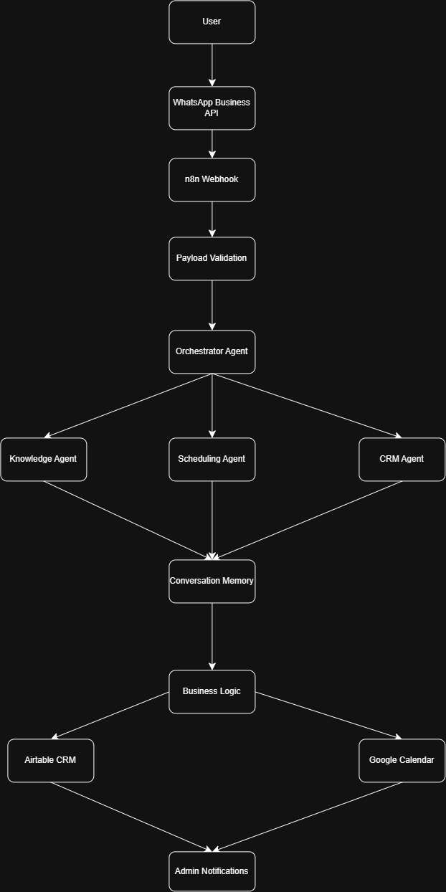
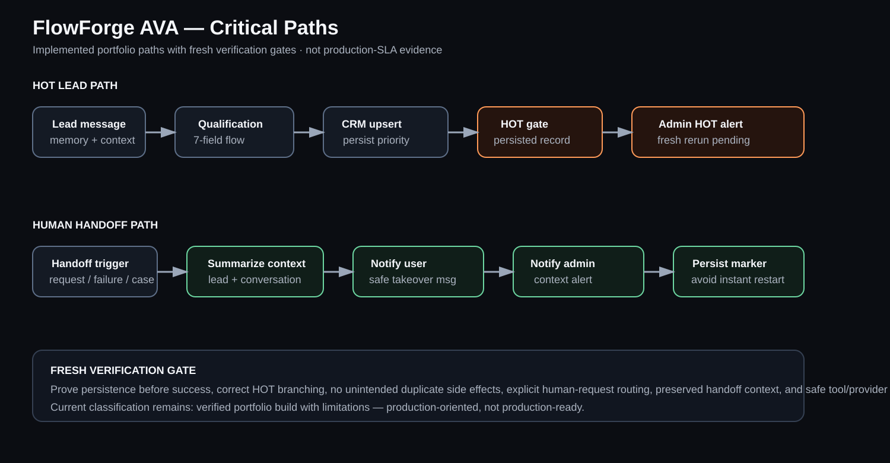
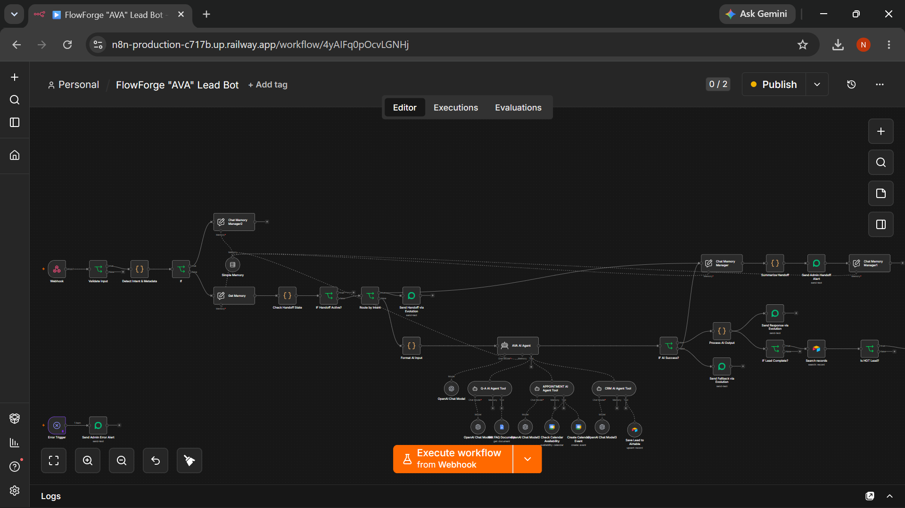

# FlowForge AVA — Multi-Agent Lead & Customer Operations System

FlowForge AVA is a **production-oriented multi-agent portfolio system** for WhatsApp-style lead handling. It demonstrates validation, intent handling, conversation memory, specialist-agent coordination, CRM/calendar actions, operational alerts, and human handoff.

> **Evidence status:** Verified build with limitations. This repository does not claim full production readiness, guaranteed reliability, measurable ROI, or verified client outcomes.


## Table of contents

- [Problem](#problem)
- [What the checked-in workflow demonstrates](#what-the-checked-in-workflow-demonstrates)
- [Generation history](#generation-history)
- [Architecture](#architecture)
- [Critical paths](#critical-paths)
- [Workflow preview](#workflow-preview)
- [Current flow](#current-flow)
- [Recorded demonstration](#recorded-demonstration)
- [Technology evidenced in the export](#technology-evidenced-in-the-export)
- [Engineering decisions](#engineering-decisions)
- [Verification status](#verification-status)
- [Security / public-export boundary](#security--public-export-boundary)
- [Known limitations](#known-limitations)
- [Repository structure](#repository-structure)
- [Evidence boundary](#evidence-boundary)

### Generation quick links

| Generation | Meaning | Status | Record |
|---|---|---|---|
| A | original lead / appointment bot structure | Historical | [README](generations/A/README.md) |
| B | knowledge-base expansion + tool/agent prompt restructuring | Historical | [README](generations/B/README.md) |
| C | prompt/tool rework while preserving actual topology after generated replacement workflows were rejected | Historical | [README](generations/C/README.md) |
| D | current AVA export, current architecture/demo evidence, buyer-proof cleanup | **Current** | [README](generations/D/README.md) |

The `generations/` folder is the engineering history. Historical generations do not get fake runtime demos/screenshots. Current Generation D uses the genuine media already checked into this repository.

## Problem

Inbound WhatsApp leads can be lost when replies are slow, qualification is inconsistent, CRM state is incomplete, scheduling is disconnected, or a conversation reaches a point where a person should take over.

AVA explores how one visible assistant can coordinate focused backend agents while keeping deterministic checks, persistence, alerts, and human handoff explicit.

## What the checked-in workflow demonstrates

- WhatsApp-style webhook intake and payload validation
- intent and metadata detection
- conversation memory and restart/handoff state
- AVA orchestrator with Q&A, scheduling, and CRM specialist agents
- Airtable lead creation/update
- Google Calendar availability checks and event creation
- human-handoff summarisation and admin alerts
- HOT/WARM/COLD lead-priority handling
- user fallback and admin error-alert paths
- explicit rules against invented pricing, ROI, or unsupported timelines

See [`workflow/README.md`](workflow/README.md) before importing [`workflow/flowforge-ava.json`](workflow/flowforge-ava.json). The export contains environment-specific resource/credential references that must be replaced before reuse.

## Generation history

The repository preserves four evidence-backed implementation generations rather than inventing semantic version numbers. Generation A is the earliest lead/appointment-bot structure; B expands the knowledge/tool structure; C records the prompt/tool rework after generated replacement workflows were rejected in favor of preserving actual topology; D is the current checked-in AVA generation.

The current workflow remains the authority for present implementation claims. Historical records explain how the system changed, not what is running now.

## Architecture

<p align="center"></p>

## Critical paths

<p align="center"></p>

The editable critical-path architecture and verification gates are documented in [`docs/CRITICAL_PATHS.md`](docs/CRITICAL_PATHS.md).

## Workflow preview

<p align="center"></p>

## Current flow

1. A WhatsApp-style message reaches the webhook.
2. Payload and message content are validated/normalized.
3. Intent, metadata, restart state, and conversation memory are inspected.
4. AVA selects the next action and can use Q&A, scheduling, or CRM specialist agents.
5. Lead information can be persisted to Airtable.
6. Calendar availability can be checked before event creation.
7. Human requests or selected fallback paths can summarize context and notify an administrator.
8. Error-trigger logic can route execution failures to an admin alert.

## Recorded demonstration

https://github.com/user-attachments/assets/c8574ce2-5e4e-486c-840f-e153035ab1dd

The recording is evidence of the portfolio build. It is **not** evidence of a production client deployment, sustained reliability, or business results.

## Technology evidenced in the export

| Layer | Repository evidence |
|---|---|
| Orchestration | n8n |
| Main agent model | OpenAI GPT-4.1 |
| Specialist models | OpenAI GPT-5-mini |
| Messaging | WhatsApp-compatible Evolution API flow |
| CRM/data | Airtable |
| Scheduling | Google Calendar |
| Handoff | context summary + user/admin path |
| Error path | n8n error trigger + admin alert / user fallback logic |

Earlier iterations explored other providers. The checked-in workflow generation is the authority for the current public implementation description.

## Engineering decisions

### One orchestrator, focused specialist agents
The visible AVA agent coordinates bounded Q&A, scheduling, and CRM roles instead of making one prompt responsible for every external action.

### Deterministic checks around model behavior
Code/IF nodes handle payload extraction, intent flags, restart state, output markers, handoff state, and other exact control decisions. AI is not treated as the only control plane.

### Human handoff remains explicit
The system prepares a context summary and alerts a person so takeover can happen without discarding the lead's recent context.

### Calendar confirmation is gated
The scheduling tool contract requires availability checking before event creation and alternatives when the requested slot is unavailable.

## Verification status

See [`docs/VERIFICATION.md`](docs/VERIFICATION.md) for the actual matrix.

Current evidence includes implementation structure and a recorded demonstration. Fresh repeatable fixtures are still needed for HOT lead persistence/alert behavior, explicit human handoff, calendar available/unavailable paths, CRM/tool/provider failure, replay behavior, and long-duration reliability/load/security/monitoring.

## Security / public-export boundary

Read [`SECURITY.md`](SECURITY.md) and [`workflow/README.md`](workflow/README.md).

Public workflow files must not be assumed portable: environment-specific credential IDs, resource IDs, account labels, webhook identifiers, document/table references, and destinations must be replaced in a controlled environment. Reusable secrets and production/customer data must never be committed.

## Known limitations

- complete retry/backoff policy is not evidenced across every external integration;
- circuit breakers/provider failover are not complete production controls;
- monitoring/logging/operational dashboards are not production-complete;
- load/security/long-duration testing is not established;
- no verified deployment at client scale;
- no measured conversion/ROI claim.

## Repository structure

```text
.
├── README.md
├── architecture.drawio.png
├── critical-paths.svg
├── workflow-preview.png
├── generations/
│   ├── A/README.md
│   ├── B/README.md
│   ├── C/README.md
│   └── D/README.md
├── docs/
│   ├── CRITICAL_PATHS.md
│   └── VERIFICATION.md
├── workflow/
│   ├── README.md
│   └── flowforge-ava.json
├── SECURITY.md
└── LICENSE
```

## Evidence boundary

This is a **production-oriented portfolio build**, not a claim of production readiness. “Production-ready” should only be used after realistic execution, error-path testing, security review, observability, deployment evidence, and sustained operating results exist.

---

Designed and engineered by **Oyekola Ololade**  
AI Systems & Integration Engineer

- [LinkedIn](https://www.linkedin.com/in/ololade-oyekola-5b1797397/)
- [GitHub](https://github.com/oyekola-ololade)
- Email: oyekolaololade69@gmail.com
