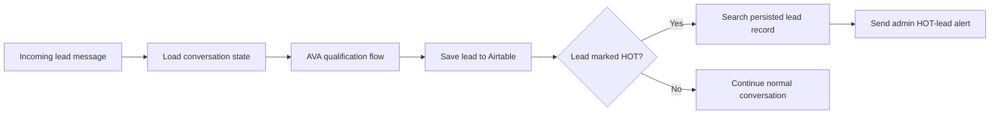
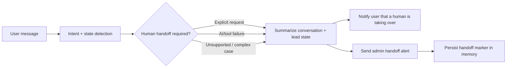
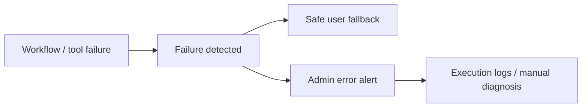

# FlowForge AVA Critical Paths

## Status

These diagrams describe the checked-in workflow structure and the verification gates that still matter. They are not production-SLA evidence.

## HOT lead path

### Fresh verification gate

The branch should only be considered freshly verified after a configured rerun proves:

- the lead is persisted before success is reported;
- the HOT/WARM/COLD value used by the alert decision matches the persisted record;
- a HOT lead triggers the intended admin alert;
- retries do not create duplicate lead records or duplicate side effects without an explicit reason;
- tool or persistence failure does not falsely imply that escalation succeeded.

## Human handoff path

### Fresh verification gate

A handoff should only be treated as complete after a configured test confirms:

- explicit human requests reach the handoff route;
- the handoff summary contains the current lead context;
- the user-facing and admin-facing messages are both attempted;
- handoff state is preserved so subsequent messages do not immediately restart autonomous qualification;
- failure to notify the human is logged or escalated rather than silently reported as success.

## Error path

The repository demonstrates explicit fallback/error nodes, but complete retry policy, provider failover, circuit breaking, long-duration reliability, and production observability remain outside the verified boundary.
