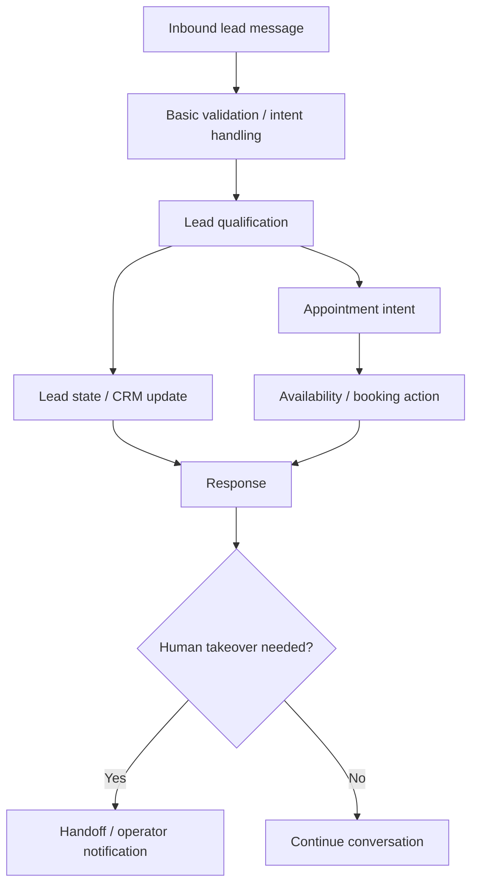

# FlowForge AVA — Generation A Architecture

> **Status:** HISTORICAL RECONSTRUCTION FROM PROJECT LINEAGE · not the current workflow graph.

## Interpretation

Generation A captures the earliest supported lead/appointment-bot architecture in the reconstructed project history. It is an explanatory historical model, not a claim that the exact current node graph already existed at this stage.
