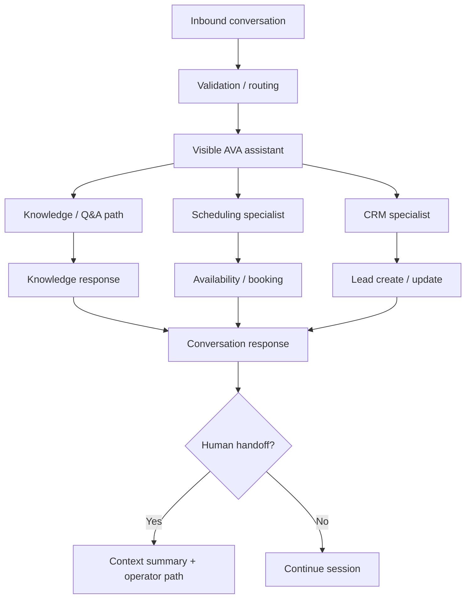

# FlowForge AVA — Generation B Architecture

> **Status:** HISTORICAL RECONSTRUCTION FROM PROJECT LINEAGE.

## Interpretation

Generation B records the expansion from a simpler lead/appointment bot toward a visible assistant coordinating knowledge, scheduling and CRM responsibilities. Exact node-level deltas remain governed by preserved workflow evidence rather than this explanatory reconstruction.
