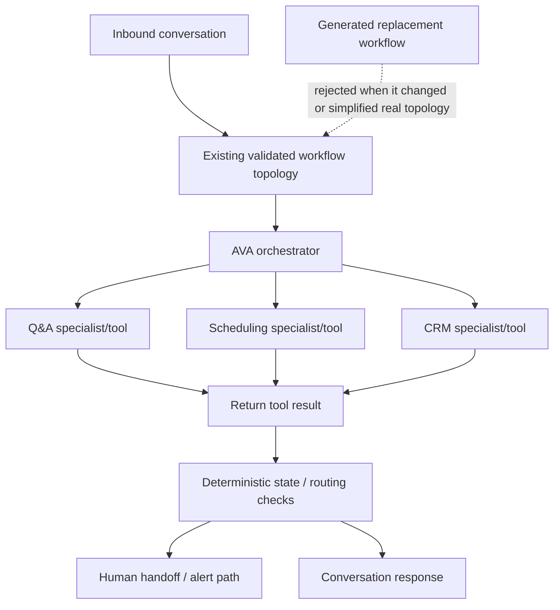

# FlowForge AVA — Generation C Architecture

> **Status:** HISTORICAL RECONSTRUCTION · topology-preservation generation.

## Interpretation

Generation C is important because documentation/prompt improvements were constrained to preserve the real orchestration graph. Generated replacement workflows that changed or simplified the implementation were rejected rather than relabelled as the same system.
