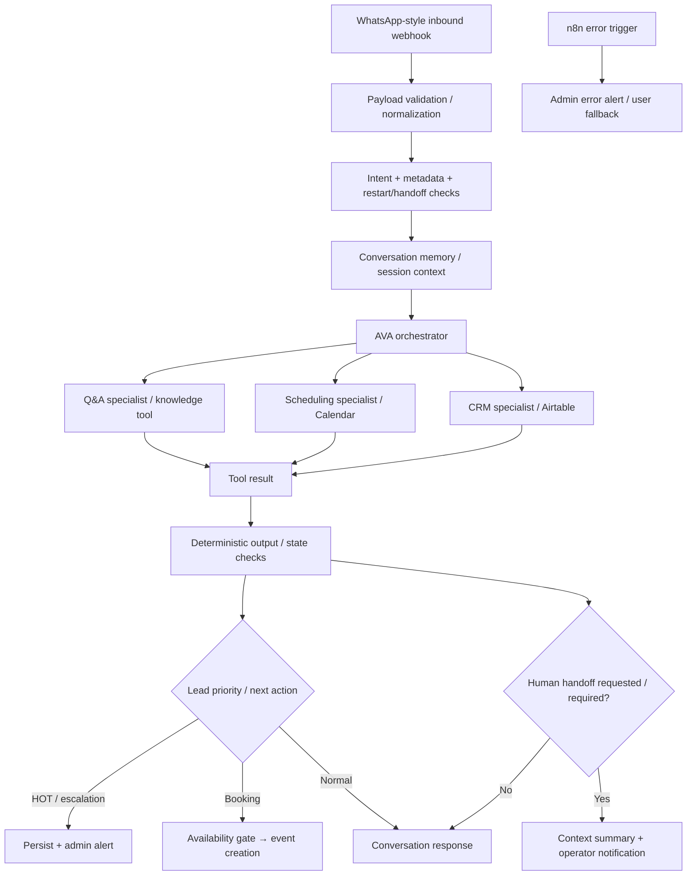

# FlowForge AVA — Generation D Current Architecture

> **Status:** CURRENT PUBLIC IMPLEMENTATION GENERATION.

## Current visual evidence

- [`../../architecture.drawio.png`](../../architecture.drawio.png) — current architecture image.
- [`../../workflow-preview.png`](../../workflow-preview.png) — current n8n workflow screenshot.
- [`../../critical-paths.svg`](../../critical-paths.svg) — HOT-lead and human-handoff critical paths.
- recorded demo linked from the root [`README.md`](../../README.md).

These artifacts demonstrate the current portfolio build. They do not prove production deployment, SLA, ROI, or client-scale reliability.
