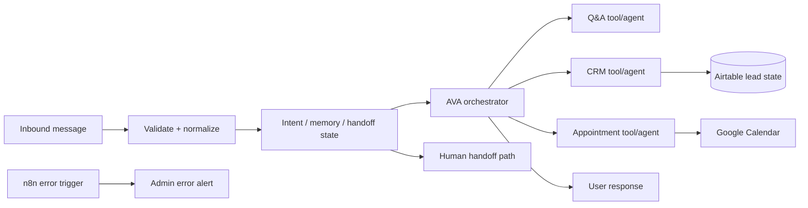

# FlowForge AVA — Generation D Current System Record

**Status:** CURRENT PUBLIC IMPLEMENTATION GENERATION · verified build with limitations  
**Current workflow authority:** `../../workflow/flowforge-ava.json`

## Current system responsibilities

Generation D is the current public implementation/evidence generation. The checked-in workflow demonstrates:

- WhatsApp-style webhook intake and validation;
- intent and metadata detection;
- conversation memory and restart/handoff state;
- AVA orchestrator;
- specialist Q&A, scheduling and CRM tools/agents;
- Airtable lead persistence;
- Google Calendar availability/event actions;
- HOT/WARM/COLD priority handling;
- human-handoff summary/admin notification;
- user fallback and admin error-alert paths.

## Current architecture

## Current evidence

- `../../architecture.drawio.png`
- `../../critical-paths.svg`
- `../../workflow-preview.png`
- genuine recorded demo linked from the root README;
- `../../docs/CRITICAL_PATHS.md`;
- `../../docs/VERIFICATION.md`.

Because current media already exists, no fake demo/screenshot placeholder is needed for FlowForge.

## Verification still required for stronger claims

- fresh HOT-lead persistence + alert run;
- explicit human-handoff run;
- calendar available/unavailable cases;
- CRM/tool/provider failure cases;
- replay/duplicate side-effect behavior;
- longer-duration reliability/load/security evidence.

## Public-export/security boundary

The current checked-in workflow is implementation evidence but contains environment-specific resource/credential references that must be replaced before reuse. A portable public workflow should be separately sanitized and import-validated rather than pretending the current environment-bound export is reusable as-is.

## Claim boundary

Supported: current multi-agent portfolio implementation with real workflow/demo evidence.  
Not supported: full production readiness, client-scale reliability, SLA, named-client deployment or measured ROI/conversion results.